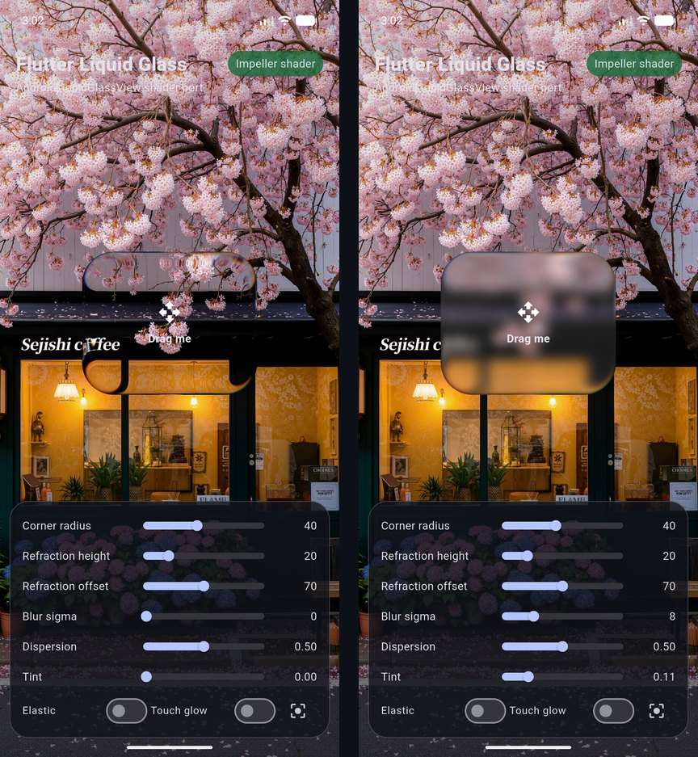

# liquid_glass_view

[](https://github.com/oabdulr/liquid_glass_view/actions/workflows/ci.yml)
[](LICENSE)
[](https://flutter.dev)

iOS 26-style **liquid glass** for Flutter. Real edge refraction, seven-tap
chromatic dispersion, blur, tint, and color grading are rendered live on the
GPU from whatever is behind the glass, with optional drag, elastic stretch,
and touch-glow interactions.

This package is a Flutter port of
**[AndroidLiquidGlassView](https://github.com/QmDeve/AndroidLiquidGlassView)**
by **Donny Yale ([@QmDeve](https://github.com/QmDeve))**. The refraction
shader, the configuration model, and the interaction physics all come from
that project. See [Credits](#credits).

<p align="center">
  
</p>

## Features

- **Physically inspired refraction.** A rounded-rectangle signed-distance
  field bends the backdrop along the glass edge, like the original AGSL
  shader.
- **Chromatic dispersion.** Seven spectrum samples (red through purple)
  split colors toward the corners.
- **Blur, tint, and color grade.** Gaussian blur before refraction, plus
  saturation, white point, contrast, and an RGB tint.
- **Live GPU sampling.** The glass reads the already-painted scene through
  `BackdropFilter`, with no screenshots, platform views, or CPU copies per
  frame.
- **Interactions.** Bounded dragging, a velocity-driven elastic stretch
  with Android's spring constants, and a press glow.
- **Android-compatible API.** `LiquidGlassController` mirrors the Android
  setters and clamp ranges, so migrating is mostly a rename.
- **Graceful fallback.** Renderers without runtime image-filter shaders get
  a blur + tint glass instead of nothing.

## Platform support

The full effect needs Flutter's **Impeller** renderer, which exposes
runtime shaders as image filters. Elsewhere the view falls back to blur and
tint automatically.

| Platform        | Rendering                                  |
| --------------- | ------------------------------------------ |
| Android, iOS    | Full effect (Impeller is the default)      |
| macOS           | Full effect when running on Impeller       |
| Windows, Linux  | Blur + tint fallback                       |
| Web             | Blur + tint fallback                       |

Check `LiquidGlassView.isHighFidelitySupported` at runtime, or listen to
`onRenderModeChanged`. The view also reports `fallback` for the few frames
while the shader compiles; call `LiquidGlassView.warmUp()` at startup to
avoid that.

## Installation

Add the package from GitHub:

```yaml
dependencies:
  liquid_glass_view:
    git:
      url: https://github.com/oabdulr/liquid_glass_view.git
      ref: main # or pin a tag / commit
```

Requires Flutter 3.41 or newer. There are no native dependencies.

## Quick start

The glass samples everything painted **before** it, so place it above your
content, typically in a `Stack`:

```dart
import 'package:flutter/material.dart';
import 'package:liquid_glass_view/liquid_glass_view.dart';

void main() {
  WidgetsFlutterBinding.ensureInitialized();
  LiquidGlassView.warmUp(); // Optional: compile the shader early.
  runApp(const MaterialApp(home: Demo()));
}

class Demo extends StatelessWidget {
  const Demo({super.key});

  @override
  Widget build(BuildContext context) {
    return Stack(
      fit: StackFit.expand,
      children: [
        Image.asset('assets/background.jpg', fit: BoxFit.cover),
        const Center(
          child: LiquidGlassView(
            width: 220,
            height: 180,
            draggable: true,
            elastic: true,
            touchEffect: true,
            config: LiquidGlassConfig(blurSigma: 8, tintAlpha: 0.1),
            child: Center(child: Text('Drag me')),
          ),
        ),
      ],
    );
  }
}
```

`child` is foreground content drawn **on** the glass and clipped to its
outline. Don't put the content you want refracted there; it belongs behind
the glass.

## Configuration

Pass an immutable `LiquidGlassConfig`, and rebuild with `copyWith` to change
it:

| Parameter          | Default | Description                                                 |
| ------------------ | ------- | ----------------------------------------------------------- |
| `cornerRadius`     | `40`    | Outline radius, clamped to half the shorter side.           |
| `refractionHeight` | `20`    | Width of the refracting band along the edge. `0` disables.  |
| `refractionOffset` | `70`    | How far the edge bends the backdrop inward.                 |
| `depthEffect`      | `0.3`   | Blends a radial normal in for a thicker-lens look.          |
| `dispersion`       | `0.5`   | Chromatic aberration strength, usually `0`–`1`.             |
| `blurSigma`        | `0.01`  | Gaussian blur applied before refraction.                    |
| `tintColor`        | white   | Tint color (its alpha is ignored).                          |
| `tintAlpha`        | `0`     | Tint strength, `0`–`1`.                                     |
| `contrast`         | `0`     | Contrast adjustment; `0` is the identity.                   |
| `whitePoint`       | `0`     | Mix toward white (positive) or black (negative).            |
| `chromaMultiplier` | `1`     | Saturation multiplier in linear sRGB.                       |
| `eccentricFactor`  | `1`     | Kept for API parity; inert, as in the Android library.      |

Distances are logical pixels, so Android `dp` values carry over unchanged.
`LiquidGlassConfig.androidDefaults` and `LiquidGlassConfig.noFilter` are
provided as presets.

### Imperative control

`LiquidGlassController` mirrors the Android setters, including their clamp
ranges, and also owns the drag translation:

```dart
final controller = LiquidGlassController();

LiquidGlassView(width: 200, height: 200, controller: controller);

controller.setCornerRadius(48);
controller.setRefractionHeight(24);
controller.setBlurRadius(12);
controller.setDispersion(0.65);
controller.setTintColor(const Color(0xFFB9D7FF));
controller.setTintAlpha(0.12);
controller.resetTranslation();
```

When a controller is supplied, its config wins over the widget's `config`.
Dispose it together with the owning `State`.

## Interactions

| Flag          | Behavior                                                                                         |
| ------------- | ------------------------------------------------------------------------------------------------ |
| `draggable`   | Drag the glass. It stays anchored to the finger and within its layout parent.                    |
| `elastic`     | Stretch along the drag direction based on pointer velocity, then spring back.                    |
| `touchEffect` | Press to show a radial glow under the pointer and spring to 1.02 scale.                          |

An interactive glass (`draggable` or `touchEffect`) consumes pointers that
land on it, as the Android view does. A passive glass is transparent to
touches, so content behind it stays tappable. Use `onTranslationChanged` or
`controller.translation` to track where the glass was dragged.

## Good to know

- **Size is explicit.** `width` and `height` are required because the
  shader needs concrete bounds. Put the view where its parent lets it pick
  its own size (`Stack`/`Positioned`, `Center`, `Align`).
- **Translate and scale transforms are supported.** The glass stays aligned
  inside scrolling lists, page views, and scaled ancestors. Rotation and skew
  are not.
- **Offscreen layers.** Inside a `ShaderMask` or similar offscreen layer,
  the glass samples that layer's texture and cannot be placed reliably.
- **Several glasses.** Each view samples independently. `backdropGroupKey`
  is forwarded to Flutter's `BackdropGroup`, but overlapping glasses must not
  share a key.
- **Performance.** One shader pass per view, seven texture samples only in
  the edge band, and the filter is clipped to the sampling area. See
  [PERFORMANCE.md](PERFORMANCE.md).

## Example app

[`example/`](example) is an interactive playground with sliders for every
main parameter, toggles for the interactions, and a badge showing the active
renderer.

```bash
cd example
flutter run
```

## Development

```bash
flutter analyze
flutter test
cd example && flutter test
```

The on-device profile benchmark and reference render live in
`example/integration_test`; see [PERFORMANCE.md](PERFORMANCE.md) for how to
run them.

Further reading:

- [MIGRATION.md](MIGRATION.md): moving from AndroidLiquidGlassView.
- [PORT_PARITY.md](PORT_PARITY.md): what matches the Android original and
  where this port intentionally differs.
- [CHANGELOG.md](CHANGELOG.md)

Issues and pull requests are welcome.

## Credits

- **[AndroidLiquidGlassView](https://github.com/QmDeve/AndroidLiquidGlassView)**
  by **Donny Yale ([@QmDeve](https://github.com/QmDeve))** is the original
  Android library this package ports. The refraction and dispersion shader,
  the configuration parameters and their defaults, the elastic spring
  physics, and the touch glow all come from it. The original shader also
  credits contributor **Ahmed Sbai ([@sbaiahmed1](https://github.com/sbaiahmed1))**.
  Documentation for the Android library is at
  [liquidglass.qmdeve.com](https://liquidglass.qmdeve.com/).
- The example's background photo comes from the original project's demo
  app.
- Flutter port by **Osamah ([@oabdulr](https://github.com/oabdulr))**.

If you're building for Android with native views, use the original library.

## License

MIT, the same license as the original project. See [LICENSE](LICENSE). All
copyright belongs to the original author, Donny Yale (QmDeve), and
contributors; this port is shared under their license.
